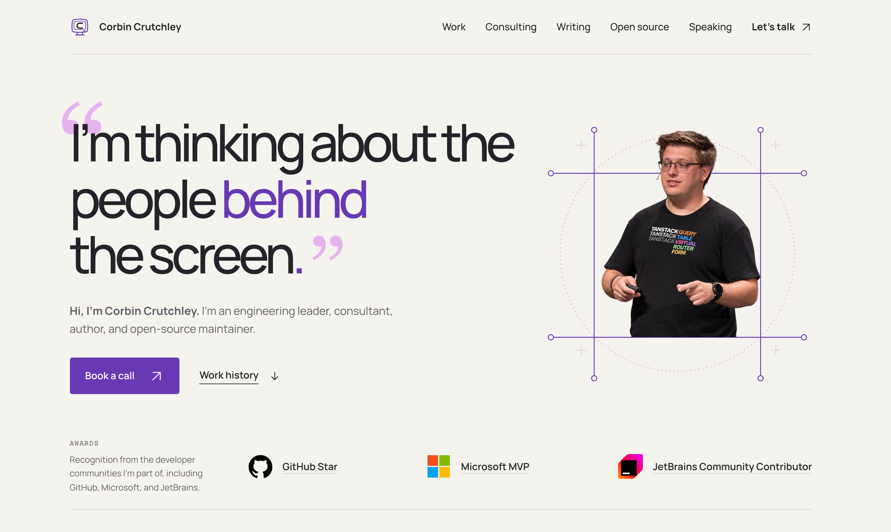

# Corbin Crutchley's Personal Site

**[Visit corbincrutchley.com](https://corbincrutchley.com/)**

Hi, I’m Corbin! I’m an engineering leader, consultant, author, and open-source maintainer in Sacramento, California. I care about helping people understand the software they use and giving teams the context they need to do their best work.

I co-founded [Playful Programming](https://playfulprogramming.com/), wrote [The Framework Field Guide](https://framework.guide/), and work on projects across the [TanStack](https://tanstack.com/), [Redux](https://redux.js.org/), and [Plop](https://plopjs.com/) communities. Making useful things and sharing what I learn are a big part of what keeps me excited about this work.

This site brings those pieces together: my work history, consulting, books and essays, open-source projects, conference talks, and podcast conversations.
